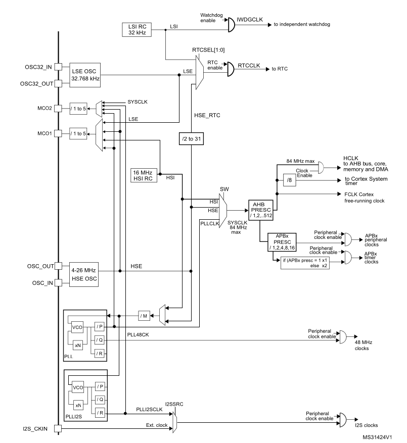
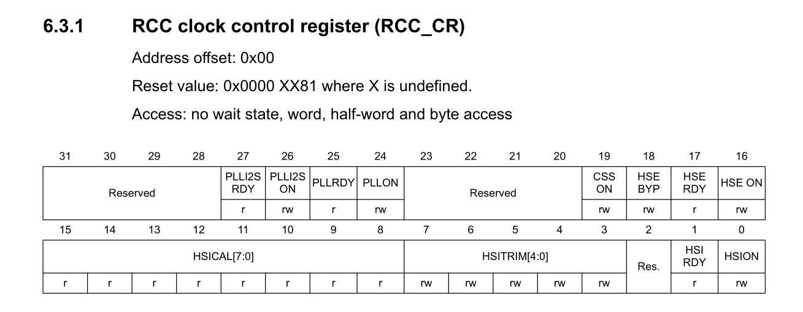
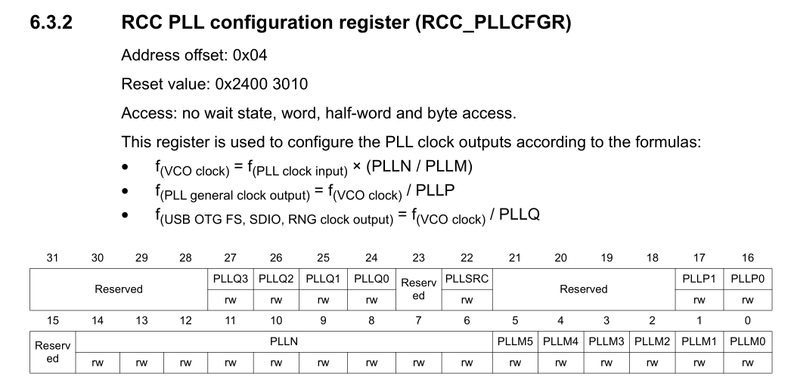
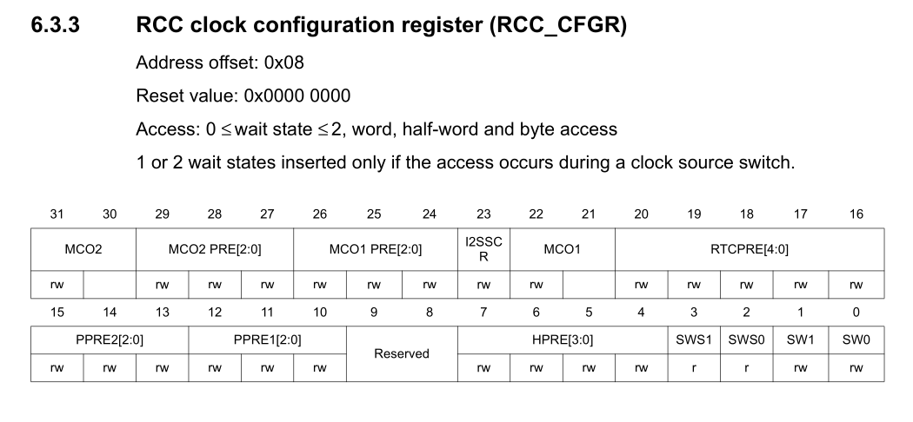
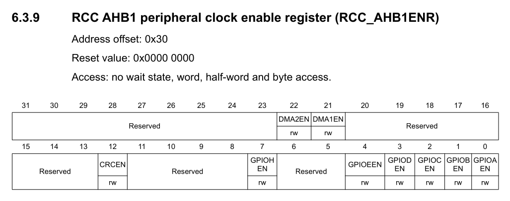
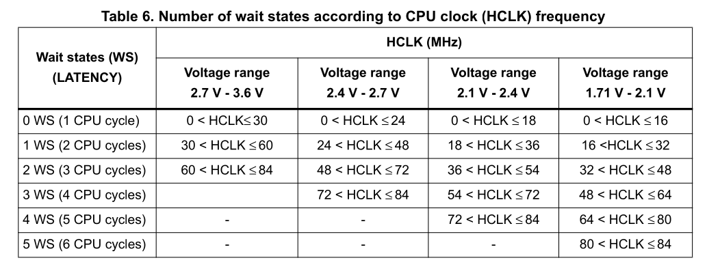

# Reset and Clock Control (RCC)

## 1. Overview

The **Reset and Clock Control (RCC)** peripheral is the heartbeat of the STM32 microcontroller. On modern ARM Cortex-M microcontrollers, power efficiency is a primary architectural goal. Consequently, **every peripheral is clock-gated (powered off) by default**.

Before you can read or write to any peripheral register — whether it is a GPIO port, a timer, an ADC, or a UART controller — you must first enable its clock through the RCC. Attempting to access a peripheral's registers while its clock is disabled results in either silent failure (writes are ignored) or a **BusFault / HardFault**.

In our example we will set the system clock(HCLK) to be 24MHz.

---

## 2. The STM32F401 Clock Tree

The STM32F401CCU6 can operate at clock frequencies up to **84 MHz**. To achieve this, it features several internal and external clock sources routed through a Phase-Locked Loop (PLL).



### 2.1 Clock Sources

| Source | Name | Typical Frequency | Characteristics |
|---|---|---|---|
| **HSI** | High-Speed Internal | 16 MHz | Built-in RC oscillator. Available instantly at power-up; slightly temperature-sensitive. |
| **HSE** | High-Speed External | 4–26 MHz (25 MHz on BlackPill) | External quartz crystal. High accuracy, required for stable USB and precision timing. |
| **PLL** | Phase-Locked Loop | Up to 84 MHz | Multiplies and divides HSI or HSE to generate higher system frequencies. |
| **LSI** | ~32 kHz | Internal low-power RC | Internal RC oscillator. Low-power, low-cost, but low accuracy. Used for IWDG and AWU; keeps running in Stop/Standby mode. |
| **LSE** | 32.768 kHz | External watch crystal | External watch crystal. Low-power but highly accurate. Used for RTC clock/calendar functions. |

#### HSE (High Speed External Clock):
The high speed external clock signal (HSE) can be generated from two possible clock sources:
- HSE external crystal/ceramic resonator
- HSE external user clock
The resonator and the load capacitors have to be placed as close as possible to the oscillator pins in order to minimize output distortion and startup stabilization time. The loading capacitance values must be adjusted according to the selected oscillator.

#### HSI (High Speed Internal Clock):
The HSI clock signal is generated from an internal 16 MHz RC oscillator and can be used directly as a system clock, or used as PLL input.
The HSI RC oscillator has the advantage of providing a clock source at low cost (no external components). It also has a faster startup time than the HSE crystal oscillator however, even with calibration the frequency is less accurate than an external crystal oscillator or ceramic resonator.

Note: The default clock is HSI if not configured.

#### PLL (Phase Locked Loop):
The PLL is used to generate a higher-speed system clock from a lower-frequency input clock source. It takes either HSI or HSE as its input reference clock and multiplies it up to produce a higher output frequency, allowing the microcontroller to run at its maximum system clock speed even though the input oscillators (HSI/HSE) run at lower frequencies.
- PLL input source can be selected as either HSI or HSE (via a configurable input MUX/divider).
- The input clock is divided and then multiplied by configurable factors(down below) to produce the desired PLL output frequency.
- The PLL output can then be selected as the system clock (SYSCLK).
- Using the PLL allows flexibility — a low-cost or low-power source like HSI can still drive the system at high speed.
- The PLL requires a short lock time to stabilize before its output can be reliably used as the system clock.

Note: PLL isn't multiply-only — it has input/output dividers too, so it can divide as well as multiply.

#### LSE (Low Speed External Clock):
The LSE clock is generated using a 32.768 kHz low speed external crystal or ceramic resonator. It has the advantage of providing a low-power but highly accurate clock source to the real-time clock peripheral (RTC) for clock/calendar or other timing functions.

#### LSI (Low Speed Internal Clock):
The LSI RC acts as a low-power clock source that can be kept running in Stop and Standby mode for the independent watchdog (IWDG) and Auto-wakeup unit (AWU). The clock frequency is around 32 kHz.

### 2.3 SYSCLK vs. HCLK vs. FCLK (Cortex Clock)
SYSCLK: The System Clock (SYSCLK) serves as the primary clock source for the microcontroller. It can be sourced from various inputs like the internal HSI, external HSE, or a PLL. SYSCLK determines the clock speed for the AHB bus after passing through the AHB Prescaler.

HCLK: The High-Speed Clock (HCLK) is essentially SYSCLK after it has been divided by the AHB Prescaler. HCLK is crucial because it feeds several critical components such as the Cortex core, the AHB bus, memory interfaces, and DMA controllers.

FCLK: The Cortex Clock (FCLK) is the clock source specifically for the processor core. Generally, FCLK is directly derived from HCLK, meaning they often run at the same frequency. However, under certain low-power scenarios or other special conditions, FCLK may differ from HCLK.


---

## 3. Bus Architecture & Peripheral Mapping

Peripherals are organized onto distinct internal buses according to their required bandwidth and clock speed:

```
  Bus      Max Speed   Peripherals Connected
 ──────   ─────────── ─────────────────────────────────────────────────────────
  AHB1      84 MHz     GPIOA, GPIOB, GPIOC, GPIOD, GPIOE, GPIOH, RCC, DMA1, DMA2
  AHB2      84 MHz     USB OTG FS
  APB1      42 MHz     TIM2, TIM3, TIM4, TIM5, USART2, I2C1, I2C2, I2C3, SPI2, SPI3, WWDG, PWR
  APB2      84 MHz     TIM1, TIM9, TIM10, TIM11, USART1, USART6, SPI1, SPI4, ADC1, SYSCFG, EXTI
```

!!! important "Bus Gating Rule"
    To configure a peripheral, identify which bus it resides on, then set the corresponding enable bit in that bus's clock register (e.g., `RCC->AHB1ENR` for GPIO, `RCC->APB1ENR` for I2C, `RCC->APB2ENR` for USART1).

---

## 4. Key RCC Registers

### 4.1 `RCC_CR` — Clock Control Register



Controls oscillators and monitors their stability flags:

| Bit(s) | Name | Description |
|---|---|---|
| 0 | `HSION` | Turn on HSI oscillator (1 = ON) |
| 1 | `HSIRDY` | HSI ready flag (1 = Stable) |
| 16 | `HSEON` | Turn on HSE oscillator (1 = ON) |
| 17 | `HSERDY` | HSE ready flag (1 = Stable) |
| 24 | `PLLON` | Turn on Main PLL (1 = ON) |
| 25 | `PLLRDY` | Main PLL ready flag (1 = Locked and stable) |

### 4.2 `RCC_PLLCFGR` — PLL Configuration Register



Formulates the PLL output clock using four dividers/multipliers:


| Field | Name | Bits | Purpose |
|---|---|---|---|
| `PLLSRC` | Source Select | 22 | `0` = HSI, `1` = HSE |
| `PLLM` | Division Factor M | 5:0 | Divides input clock to 1–2 MHz (recommended 1 MHz) |
| `PLLN` | Multiplication Factor N | 14:6 | Multiplies VCO frequency ($192 \le N \le 432$) |
| `PLLP` | Main System Division P | 17:16 | Divides VCO to system clock (`00`=/2, `01`=/4, `10`=/6, `11`=/8) |
| `PLLQ` | USB OTG FS Division Q | 27:24 | Divides VCO to 48 MHz for USB operations |

In our case we have PLLSRC is HSE and the frequeny is 25MHz and PLLM=25 PLLN=192 and PLLP=8 which gives the PLL frequency to be 24MHz.

### 4.3 `RCC_CFGR` — Clock Configuration Register



Selects which clock drives `SYSCLK` and configures bus prescalers:

| Field | Name | Bits | Purpose |
|---|---|---|---|
| `SW[1:0]` | System Clock Switch | 1:0 | `00` = HSI, `01` = HSE, `10` = PLL |
| `SWS[1:0]` | Switch Status (Read-Only) | 3:2 | Indicates active system clock (`00` = HSI, `01` = HSE, `10` = PLL) |
| `HPRE[3:0]` | AHB Prescaler | 7:4 | `0xxx` = Not divided, `1000` = /2, `1001` = /4, etc. |
| `PPRE1[2:0]` | APB1 Prescaler | 12:10 | `0xx` = Not divided, `100` = /2 (APB1 max is 42 MHz!) |
| `PPRE2[2:0]` | APB2 Prescaler | 15:13 | `0xx` = Not divided, `100` = /2 |

### 4.4 `RCC_AHB1ENR` — AHB1 Peripheral Clock Enable



Enables peripheral clocks on AHB1.

#### **Why are we setting the clock frequency to 24MHz?**

Since our HCLK < 30 MHz, we don't need any wait cycles, and therefore no FLASH_ACR wait state configuration is required. This keeps SystemClockInit() simpler — at higher SYSCLK frequencies (e.g. 84 MHz), you'd need to set the appropriate flash latency bits before switching SYSCLK to the PLL, otherwise the CPU can fetch corrupted instructions. Staying under 30 MHz lets us skip that step entirely.



## 5. Driver Implementation

### 5.1 Initializing System Clock (`SystemClockInit`)

This function transitions the CPU from the default internal 16 MHz HSI to an external 25 MHz crystal stabilized and multiplied by the PLL to target higher operational frequencies.

```c
void SystemClockInit(void) {
    // 1. Turn on External High-Speed Oscillator (HSE)
    RCC->CR |= RCC_CR_HSEON;
    while (!(RCC->CR & RCC_CR_HSERDY)); // Wait until HSE is stable

    // 2. Configure PLL factors (Source = HSE, M = 25, N = 192, P = 8)
    RCC->PLLCFGR &= ~(RCC_PLLCFGR_PLLSRC | RCC_PLLCFGR_PLLM | RCC_PLLCFGR_PLLN
                    | RCC_PLLCFGR_PLLP   | RCC_PLLCFGR_PLLQ);

    RCC->PLLCFGR |= RCC_PLLCFGR_PLLSRC_HSE
                 | (25u  << RCC_PLLCFGR_PLLM_Pos)
                 | (192u << RCC_PLLCFGR_PLLN_Pos)
                 | (3u   << RCC_PLLCFGR_PLLP_Pos);

    // 3. Set Bus Prescalers (AHB = /1, APB1 = /1, APB2 = /1)
    RCC->CFGR &= ~(RCC_CFGR_HPRE | RCC_CFGR_PPRE1 | RCC_CFGR_PPRE2);
    RCC->CFGR |= RCC_CFGR_HPRE_DIV1 | RCC_CFGR_PPRE1_DIV1 | RCC_CFGR_PPRE2_DIV1;

    // 4. Turn on the PLL and wait for lock
    RCC->CR |= RCC_CR_PLLON;
    while (!(RCC->CR & RCC_CR_PLLRDY));

    // 5. Switch System Clock (SYSCLK) to PLL output
    RCC->CFGR &= ~RCC_CFGR_SW;
    RCC->CFGR |= RCC_CFGR_SW_PLL;

    // 6. Wait until hardware confirms PLL is the active system clock source
    while ((RCC->CFGR & RCC_CFGR_SWS) != RCC_CFGR_SWS_PLL);
}
```


**Why are wait loops (`while`) necessary?** 
Physical oscillators take milliseconds to stabilize their vibration frequency, and the PLL analog feedback loop takes microseconds to lock phase. Switching the CPU clock to an unready oscillator causes immediate code execution lockup. The hardware signals readiness via `HSERDY` and `PLLRDY`.

### 5.2 Enabling GPIO Port Clocks (`RCC_GPIOClockEnable`)

Because GPIO ports are independent blocks on AHB1, we dynamically enable the port clock by matching the port pointer:

```c
void RCC_GPIOClockEnable(GPIO_TypeDef *port) {
    if (port == GPIOA)
        RCC->AHB1ENR |= RCC_AHB1ENR_GPIOAEN;
    else if (port == GPIOB)
        RCC->AHB1ENR |= RCC_AHB1ENR_GPIOBEN;
    else if (port == GPIOC)
        RCC->AHB1ENR |= RCC_AHB1ENR_GPIOCEN;
    else if (port == GPIOD)
        RCC->AHB1ENR |= RCC_AHB1ENR_GPIODEN;
    else if (port == GPIOE)
        RCC->AHB1ENR |= RCC_AHB1ENR_GPIOEEN;
    else if (port == GPIOH)
        RCC->AHB1ENR |= RCC_AHB1ENR_GPIOHEN;
}
```

Tracing the clock path: Looking at the clock tree diagram, the path a peripheral clock takes is: System Clock MUX → SYSCLK → AHB Prescaler → HCLK. From HCLK, the clock branches out to power the Cortex core, the AHB bus, memory, and DMA directly, while also feeding the APB1 and APB2 buses (via their respective prescalers) which in turn drive peripheral modules like timers, USART, and I2C.

Because a peripheral clock has to propagate through this whole chain before it's actually live at the peripheral, there's a small but real delay between setting the enable bit and the clock signal reaching the peripheral.

!!! note "Why only |= and no clear step here?"
	Each branch above sets exactly one bit, so a plain |= is safe — it turns that bit on without disturbing any others. This only works because we know just one bit is being touched at a time.

!!! tip "Hardware Delay After Clock Enable"
    According to the STM32 Cortex-M4 programming guidelines, after setting a bit in an enable register (such as `AHB1ENR`), a delay of at least two peripheral bus cycles is required before accessing the peripheral's registers. In practice, performing a dummy read guarantees the bus has synchronized:
    ```c
    RCC->AHB1ENR |= RCC_AHB1ENR_GPIOCEN;
    volatile uint32_t dummy = RCC->AHB1ENR; // Ensures clock is active before register writes
    ```

### 5.3 Generic Clock Enable Helper (`RCC_ClockEnable`)

For arbitrary peripherals across various buses, a generic pointer-mask helper enables straightforward configuration:

```c
void RCC_ClockEnable(volatile uint32_t *enr, uint32_t mask) {
    *enr |= mask;
}
```

---

## 6. Key Takeaways

!!! tip "Key Takeaways"
    1. **Clock Gating by Default**: All peripheral hardware starts in a powered-off state. You must explicitly set the corresponding bit in `RCC_AHBxENR` or `RCC_APBxENR`.
    2. **Wait for Ready Flags**: Never switch clock sources without verifying the respective `*RDY` flag in `RCC_CR`.
    3. **Respect Bus Limits**: APB1 maximum frequency is **42 MHz**, whereas AHB and APB2 can reach **84 MHz**.
    4. **Bus Synchronization**: Allow a small delay or execute a dummy read on the enable register before modifying peripheral registers.
	5. **Wait States**: Flash wait states must be configured whenever HCLK exceeds the safe read threshold (30 MHz at typical VDD) — staying below it, as with our 24 MHz setup, lets you skip FLASH_ACR configuration entirely.

## 7. RCC & Clock Tree Brush-Up Questions & Answers

**1. Why are peripherals clock-gated by default on ARM Cortex-M MCUs?**
To save power — an unused peripheral consuming clock cycles wastes energy for nothing, so hardware keeps every peripheral's clock off until software explicitly enables it.

**2. What happens if you try to access a peripheral's registers before enabling its clock?**
The write is either silently ignored, or on stricter cores generates a BusFault/HardFault, since the register bus has no live clock to complete the transaction.

**3. What is HSI, and what's its main advantage over HSE?**
HSI is a 16 MHz internal RC oscillator. Its advantage is instant availability at power-up with no external components — HSE needs a crystal and a stabilization delay.

**4. What is HSE, and why would you use it over HSI?**
HSE is an external crystal/resonator (4–26 MHz). It's far more frequency-accurate than HSI, which matters for precision timing and is mandatory for stable USB operation.

**5. What does the PLL do, and why is it needed?**
The PLL multiplies (and divides) a lower-frequency input clock (HSI or HSE) up to a much higher frequency, letting the MCU run at its maximum speed even from a cheap or low-power source oscillator.

**6. What are LSI and LSE used for?**
LSI (~32 kHz internal) powers the independent watchdog and auto-wakeup and keeps running in low-power modes. LSE (32.768 kHz external crystal) drives the RTC for accurate clock/calendar timing.

**7. What is the difference between SYSCLK and HCLK?**
SYSCLK is the raw selected system clock source (HSI/HSE/PLL). HCLK is SYSCLK after passing through the AHB prescaler — it's what actually feeds the core, AHB bus, memory, and DMA.

**8. What is FCLK, and how does it usually relate to HCLK?**
FCLK is the clock specifically for the Cortex-M core. It's normally the same frequency as HCLK, differing only in certain low-power/special conditions.

**9. Why are peripherals split across AHB1, AHB2, APB1, and APB2 buses instead of one shared bus?**
Different peripherals have different bandwidth and speed needs; splitting buses lets high-speed peripherals (GPIO, DMA) run at full core speed while slower ones (some timers, USART2) share a lower-speed bus without holding back the fast ones.

**10. Which bus has the lowest maximum frequency on the STM32F401, and what does that mean practically?**
APB1, capped at 42 MHz — peripherals on it (TIM2-5, I2C1-3, USART2, SPI2/3) can never run faster than that, even if SYSCLK itself is higher.

**11. What register would you check, and what bit, to confirm HSE has stabilized before using it?**
`RCC_CR`, the `HSERDY` bit (bit 17) — it reads 1 once the external oscillator's output is stable.

**12. Why does switching SYSCLK to the PLL require a `while` loop polling `SWS`, not just setting `SW`?**
Setting `SW` only requests the switch; the hardware takes a few cycles to actually complete it. `SWS` is the read-only status confirming which source is *actually* active, so polling it avoids proceeding on a switch that hasn't taken effect yet.

**13. What does `PLLM` do, and why is there a "recommended 1–2 MHz" input range for it?**
`PLLM` divides the input reference clock down before it enters the PLL's voltage-controlled oscillator (VCO). The 1–2 MHz range is recommended because the VCO's internal phase comparator is designed and characterized for accurate locking within that input range — feeding it too high or low a frequency degrades PLL stability/accuracy.

**14. What is the difference between `PLLN` and `PLLP`?**
`PLLN` multiplies the divided input up to the internal VCO frequency (constrained roughly 192–432 MHz). `PLLP` then divides that VCO output down to the final SYSCLK frequency.

**15. Why does `PLLQ` exist separately from `PLLP`?**
Because USB requires an exact 48 MHz clock, which usually isn't the same frequency needed for SYSCLK. `PLLQ` gives an independent divider off the same VCO so USB can get 48 MHz regardless of what SYSCLK is set to.

**16. Why must you enable a peripheral's clock before configuring its registers, and where is that enable bit typically located?**
Because until the clock reaches the peripheral, its registers are unpowered and non-responsive; the enable bit lives in the corresponding bus's enable register (`RCC_AHB1ENR`, `RCC_APB1ENR`, `RCC_APB2ENR`), matching whichever bus that peripheral is wired to.

**17. Why is a short delay (or dummy read) recommended immediately after setting a peripheral clock-enable bit?**
The enable signal takes a few peripheral bus cycles to actually propagate and synchronize before the peripheral is truly ready; accessing its registers immediately after setting the bit can hit it before it's live, and a dummy read forces the bus transaction to complete first.

**18. What are flash wait states, and why does raising HCLK eventually require them?**
Wait states are extra CPU cycles inserted when reading flash memory, because flash access time doesn't scale as fast as CPU clock speed — above a certain HCLK threshold (~30 MHz at typical VDD on STM32F401), the core would fetch corrupted/incomplete instructions without added latency cycles to let flash catch up.

**19. In the code example, why is `RCC->AHB1ENR |= RCC_AHB1ENR_GPIOCEN;` used instead of a clear-then-set pattern?**
Because exactly one bit is being modified and nothing else in that register needs to change — a plain OR sets that bit without disturbing any other peripheral's already-enabled clock bit, so a clear step is unnecessary and would risk masking bits it shouldn't.

**20. Why must HSE be turned on and confirmed ready before configuring `PLLCFGR` with `PLLSRC` = HSE?**
The PLL's input reference must already be a stable, running clock before you can feed it into the PLL and expect a reliable lock — configuring the PLL to source from an oscillator that isn't yet oscillating produces an undefined/unlocked PLL output.

**21. What would happen if you switched SYSCLK to the PLL (`SW = PLL`) before `PLLRDY` was set?**
The system clock mux would be pointed at an output that isn't stable or valid yet, risking the CPU running on a glitchy or wrong-frequency clock — potentially causing an immediate crash or unpredictable execution.

**22. Why does the clock tree route through prescalers (`HPRE`, `PPRE1`, `PPRE2`) instead of every bus running at raw SYSCLK speed?**
Different peripheral buses have different maximum rated speeds (e.g., APB1's 42 MHz ceiling); prescalers let you run the core/AHB at full speed while independently scaling down APB1/APB2 to stay within each bus's own frequency limit.

**23. If you needed USB OTG FS to work correctly, what part of the PLL configuration becomes mandatory, and why?**
`PLLQ` must be set so the PLL's USB output tap equals exactly 48 MHz — USB timing tolerances are tight enough that any deviation from 48 MHz will cause the USB peripheral to fail to enumerate or communicate reliably.

**24. Why is HSE generally required (rather than HSI) for stable USB operation, even though HSI can also feed the PLL?**
USB's tight clock accuracy requirements exceed what HSI's internal RC oscillator can reliably provide over temperature and voltage variation; HSE's crystal-based accuracy is needed to keep the derived 48 MHz within USB's tolerance.

**25. Trace the full clock path from HSE to a GPIO register write being valid — what has to happen in order?**
HSE is enabled and confirmed ready (`HSERDY`) → PLL is configured with HSE as source and appropriate M/N/P → PLL is enabled and confirmed locked (`PLLRDY`) → SYSCLK is switched to PLL and confirmed active (`SWS`) → HCLK derives from SYSCLK via the AHB prescaler → the GPIO port's AHB1 clock-enable bit is set in `RCC_AHB1ENR` → after allowing bus synchronization (dummy read/delay), the GPIO's registers are live and safe to write.
