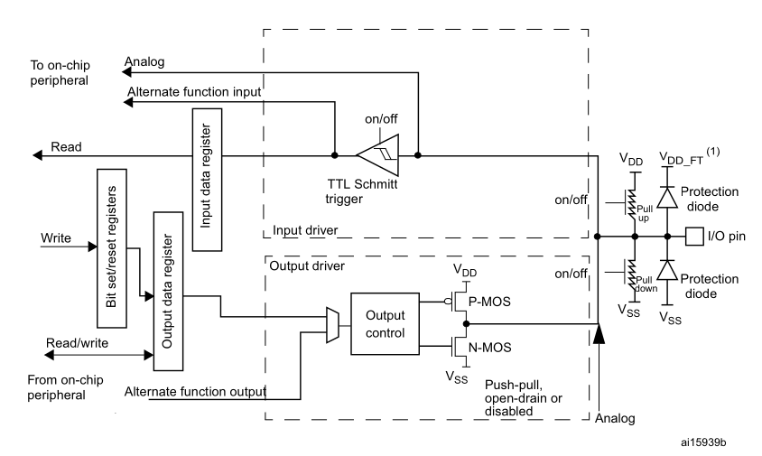
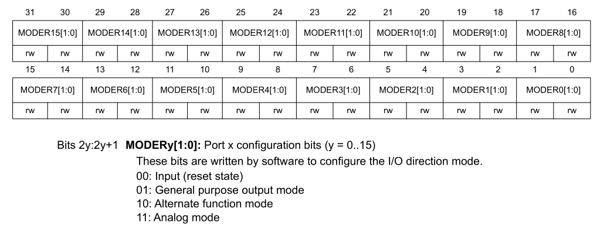
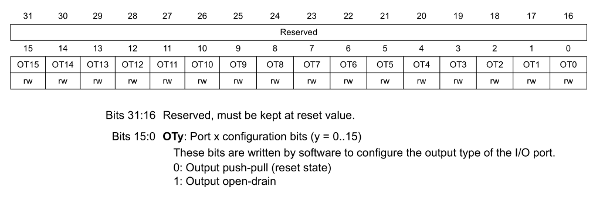
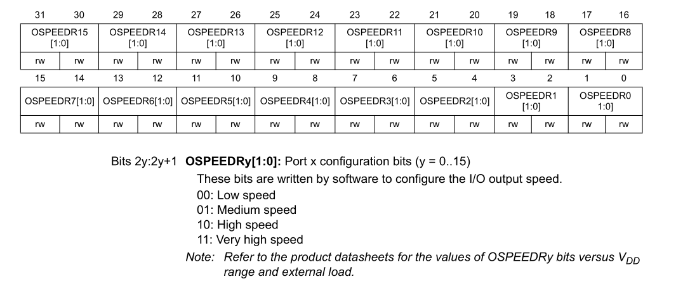
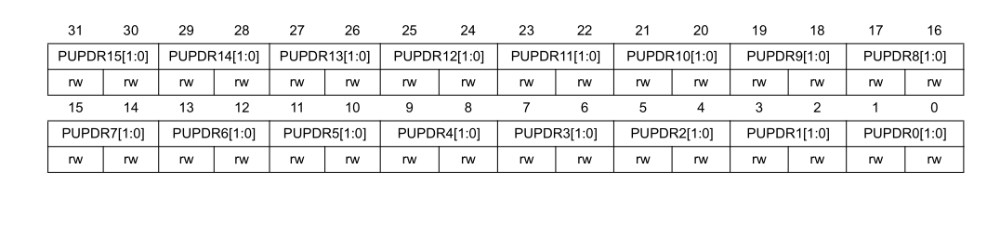
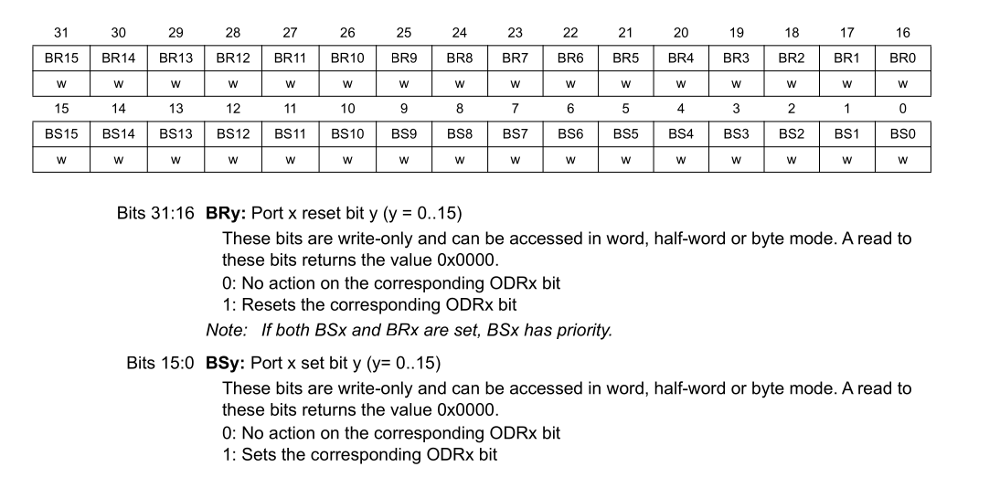
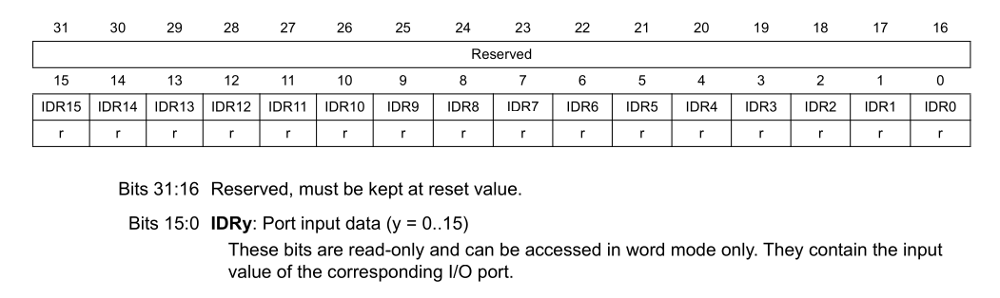
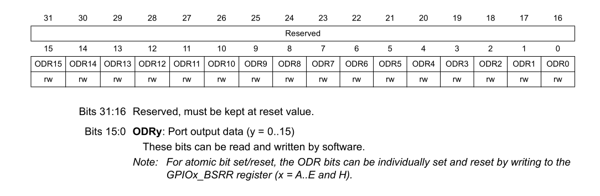

# General Purpose Input/Output (GPIO)

## 1. Overview

General Purpose Input/Output (GPIO) pins are the primary interface through which a microcontroller interacts with external electronics — reading buttons and sensors, driving status LEDs, controlling displays, or switching communication lines.

In the STM32F401, pins are grouped into **ports** labeled **A, B, C, D, E, and H**. Each port controls up to **16 physical pins** (labeled Pin 0 through Pin 15). Every pin is highly configurable and can be placed into one of four distinct functional modes:

1. **Digital Input**: Reads high or low voltage levels (e.g., push buttons, sensors).
2. **Digital Output**: Drives a pin to 3.3V or 0V (e.g., LEDs, relays, control signals).
3. **Alternate Function**: Re-routes the pin to an internal hardware peripheral (e.g., UART Tx/Rx, SPI SCK/MOSI, I2C SDA/SCL).
4. **Analog Mode**: Disconnects digital input Schmitt triggers to allow the Analog-to-Digital Converter (ADC) to sample continuous voltage levels without leakage.

---

## 2. Internal Architecture

Each pin contains internal pull-up/pull-down resistors, protection diodes, an input Schmitt trigger, and dual output transistors (P-MOS and N-MOS):



### 2.1 TTL Schmitt Trigger:

Converts the analog pin voltage into a clean digital signal using two thresholds (V_IH ≈0.7×VDD, V_IL ≈0.3×VDD), not one — the gap between them is hysteresis, which rejects noise so the output doesn't chatter. Its output slews fast regardless of how slow/noisy the input edge is, protecting downstream logic from shoot-through current. Has its own on/off switch, disabled in analog mode to stop it drawing static current from a mid-band analog voltage. 

### 2.2 I/O Pin

The single physical node everything connects to. Sits between VDD/VSS and a separate VDD_FT rail used only on 5V-tolerant (FT) pins. Whether a pin is FT or not determines what voltage its protection diode clamps to, and thus whether it can safely see voltages above VDD.

### 2.3 Protection Diodes

Two clamp diodes: one to VDD(_FT) catches overvoltage spikes, one to VSS catches negative spikes. Invisible during normal 0–VDD swings; they only conduct during ESD/transient events. Datasheets specify a max injection current they can survive before damage.

### 2.4 Pull-up / Pull-down (switched resistors)

Two independently switchable weak resistors (tens of kΩ), one to VDD, one to VSS — only one enabled at a time via PUPDR bits. Purpose: give a floating pin a defined default state. Being "weak," they're easily overridden by an external driver or active output without a current fight.

### 2.5 Input Data Register

A latch continuously updated with the Schmitt trigger's digitized output; software Read pulls directly from here. Purely passive — it doesn't affect what happens on the pin, it just records what came in.

### 2.6 Alternate Function Input tap

The Schmitt trigger's output is broadcast to both the input data register and directly to on-chip peripherals (UART Rx, SPI MISO, etc.) simultaneously. GPIO and alternate-function peripherals share this same digitized signal — no separate physical path.

### 2.7 Analog path

A direct wire from the I/O pin straight to on-chip peripherals (ADC/DAC), completely bypassing the Schmitt trigger. This is what's actually used in analog mode, since digitizing would destroy the analog value.

### 2.8 Bit Set/Reset Registers

Write-only atomic register — a single write sets or clears one output bit without needing a prior read. Prevents race conditions where an interrupt modifies another pin on the same port mid read-modify-write.

### 2.9 Output Data Register

Holds the software-intended output level; can be written atomically (via bit set/reset register) or directly (Read,Modify,Write). Feeds into the output mux as one of two possible drive sources.

### 2.10 Output Mux + Output Control

The mux selects between the GPIO's own output data register and an alternate function output from a peripheral (timer/PWM, UART Tx, etc.) — this is the output-side counterpart to the input tap. Output control then decides how to drive the P-MOS/N-MOS pair based on configured output type.

### 2.11 P-MOS / N-MOS Output Pair

P-MOS (source→VDD) sources current to pull the pin HIGH; N-MOS (source→VSS) sinks current to pull it LOW. Mode label push-pull / open-drain / disabled sets behavior: push-pull drives both complementarily (always actively driven); open-drain only ever uses N-MOS (HIGH state needs a pull-up); disabled turns both off (input/analog mode).

---

## 3. Hardware Registers

Every GPIO port has a dedicated block of memory-mapped registers at an address offset specified in the Reference Manual (RM0368):

| Register | Offset | Access | Description |
|---|---|---|---|
| `MODER` | `0x00` | Read/Write | Mode register (2 bits per pin) |
| `OTYPER` | `0x04` | Read/Write | Output type register (1 bit per pin) |
| `OSPEEDR` | `0x08` | Read/Write | Output speed / slew rate (2 bits per pin) |
| `PUPDR` | `0x0C` | Read/Write | Pull-up / pull-down resistor configuration (2 bits per pin) |
| `IDR` | `0x10` | Read-Only | Input data register (reflects pin voltages) |
| `ODR` | `0x14` | Read/Write | Output data register (software driven states) |
| `BSRR` | `0x18` | Write-Only | Bit Set/Reset Register (atomic pin manipulation) |
| `LCKR` | `0x1C` | Read/Write | Configuration lock register |
| `AFR[0]` | `0x20` | Read/Write | Alternate function low register (pins 0 to 7, 4 bits per pin) |
| `AFR[1]` | `0x24` | Read/Write | Alternate function high register (pins 8 to 15, 4 bits per pin) |

---

## 4. Configuration Modes

### 4.1 Pin Mode (`MODER`)

Each pin uses 2 bits to define its role:

| Value | Mode | Description |
|:---:|---|---|
| `00` | **Input** | Default state after reset. The pin senses voltage without driving. |
| `01` | **General Purpose Output** | Software directly controls pin voltage via `ODR` or `BSRR`. |
| `10` | **Alternate Function** | Internal peripheral (USART, SPI, TIM) drives and senses the pin. |
| `11` | **Analog** | Disconnects the digital buffer to save power and enable ADC sampling. |



### 4.2 Output Type: Push-Pull vs. Open-Drain (`OTYPER`)

- **Push-Pull (`0`)**: Both P-MOS and N-MOS transistors are active.
  - When driven **HIGH**, the pin actively connects to 3.3V (sources current).
  - When driven **LOW**, the pin actively connects to GND (sinks current).
  - *Standard choice for LEDs, digital communication, and motor drivers.*

- **Open-Drain (`1`)**: Only the bottom N-MOS transistor is active.
  - When driven **LOW**, the pin actively connects to GND.
  - When driven **HIGH**, the transistor turns off, leaving the pin **floating (High-Z)**.
  - An external or internal pull-up resistor is required to pull the line up to VDD.
  - *Essential for shared bus protocols like I2C or multi-drop lines where multiple devices share a line without short-circuit risk.*



### 4.3 Output Speed Register (`OSPEEDR`)

OSPEEDR sets the output transistors' slew rate (edge speed), not a toggle frequency — higher settings give faster, cleaner edges at the cost of more EMI and switching current. Pick the lowest speed that still meets your signal's timing needs (e.g., SPI clock rate), since over-speeding a slow signal like an LED just adds noise for no benefit.




### 4.4 Pull-Up / Pull-Down Resistors (`PUPDR`)

When a pin is configured as an input and nothing is connected to it, it is in a "floating" state and will oscillate unpredictably between 0 and 1 due to ambient electromagnetic noise.

- **`00` (None)**: Floating input; used when an external resistor or driver already biases the line.
- **`01` (Pull-Up)**: Activates an internal ~40 kΩ resistor connected to 3.3V. Pin reads `1` when idle.
- **`10` (Pull-Down)**: Activates an internal ~40 kΩ resistor connected to GND. Pin reads `0` when idle.



### 4.4 Bit Set/Reset Register (`BSRR`)

The `BSRR` is a 32-bit **write-only** register specifically designed to eliminate read-modify-write hazards.



**Why use `BSRR` instead of `ODR`?**
If you use `ODR` to set a pin:
```c
port->ODR |= (1 << pin); // Read ODR -> Modify bit -> Write ODR
```
If an interrupt occurs between the Read and the Write and modifies another pin in the same port, the second pin's modification is overwritten and lost when the original code completes.

Writing directly to `BSRR`:
```c
port->BSRR = (1 << pin); // Single atomic machine instruction!
```
Because writing `0` does nothing, writing to pin $y$ leaves all other 15 pins completely untouched without reading first.

---

### 4.5 Input Data Register (`IDR`)

IDR (Input Data Register) is a read-only register where each bit continuously reflects the Schmitt trigger's digitized output for that pin — it's a live snapshot, not a latch that captures a single event. A software Read just samples whatever's currently in this register, so catching a brief pulse requires polling fast enough or using an edge interrupt (EXTI) instead. It has no write access and no effect on the pin itself — purely a passive record of the input state.



### 4.6 Output Data Register (`ODR`)

ODR (Output Data Register) is the read/write register holding the software-intended output level for each pin — writing a bit here sets what the output driver should push onto that pin (subject to push-pull/open-drain mode). Unlike IDR, it's not passive: changing a bit in ODR directly drives the P-MOS/N-MOS pair, so a whole-register write is atomic-safe, but modifying just one bit (ODR |= ...) is a read-modify-write and can race with an interrupt touching another pin on the same port. That's exactly why BSRR exists — it lets you flip a single pin's output atomically without ever reading ODR first.



## 5. Driver Implementation

### 5.1 Initializing a Pin (`GPIO_Init`)

The initialization function sets up the pin's mode, speed, pull-up/pull-down configuration, output type, and optional alternate function mapping:

```c
void GPIO_Init(GPIO_TypeDef *port, const GPIO_Config *cfg) {
    // 1. Ensure the port's AHB1 clock is enabled
    RCC_GPIOClockEnable(port);

    // 2. Set Pin Mode in MODER (2 bits per pin)
    port->MODER  &= ~(0x3 << (cfg->pin * 2));
    port->MODER  |=  (cfg->mode << (cfg->pin * 2));

    // 3. Set Output Type in OTYPER (1 bit per pin)
    port->OTYPER &= ~(0x1 << cfg->pin);
    port->OTYPER |=  (cfg->otype << cfg->pin);

    // 4. Set Slew Rate / Speed in OSPEEDR (2 bits per pin)
    port->OSPEEDR &= ~(0x3 << (cfg->pin * 2));
    port->OSPEEDR |=  (cfg->speed << (cfg->pin * 2));

    // 5. Configure Pull-Up / Pull-Down in PUPDR (2 bits per pin)
    port->PUPDR &= ~(0x3 << (cfg->pin * 2));
    port->PUPDR |=  (cfg->pull << (cfg->pin * 2));

    // 6. If Alternate Function, configure AFR[0] (pins 0-7) or AFR[1] (pins 8-15)
    if (cfg->mode == GPIO_MODE_AFM) {
        uint8_t shift = (cfg->pin > 7) ? (cfg->pin - 8) : cfg->pin;
        if (cfg->pin < 8) {
            port->AFR[0] &= ~(0xF << (4 * shift));
            port->AFR[0] |=  (cfg->af << (4 * shift));
        } else {
            port->AFR[1] &= ~(0xF << (4 * shift));
            port->AFR[1] |=  (cfg->af << (4 * shift));
        }
    }
}
```

### 5.2 Writing to a Pin (`GPIO_WritePin`)

This function commands a physical pin to either logic high or logic low using the atomic `BSRR` register:

```c
void GPIO_WritePin(GPIO_TypeDef *port, uint8_t pin, uint8_t state) {
    if (state)
        port->BSRR = (1U << pin);        // Set pin HIGH (3.3V)
    else
        port->BSRR = (1U << (pin + 16)); // Reset pin LOW (0V)
}
```

**What actually happens when you call `GPIO_WritePin`?**

1. **When `state = 1`**:
   - The driver writes to bit `pin` in `BSRR` (bits 0–15).
   - The hardware drives the physical pin to **+3.3V (Logic HIGH)**.

2. **When `state = 0`**:
   - The driver writes to bit `(pin + 16)` in `BSRR` (bits 16–31).
   - The hardware drives the physical pin to **0V / GND (Logic LOW)**.

### 5.3 Active-High vs. Active-Low Circuits

How your circuit reacts to `GPIO_WritePin` depends entirely on whether it is wired **Active-High** or **Active-Low**:

**Case A: Active-High Circuit (Standard)**
```
  Pin ───▶ [ Resistor ] ───▶ [ LED Anode (+) ] ───▶ [ Cathode (-) ] ───▶ GND
```
- `GPIO_WritePin(port, pin, 1)` → Output is 3.3V → Voltage across LED → **Turns ON**
- `GPIO_WritePin(port, pin, 0)` → Output is 0V → No voltage difference → **Turns OFF**

**Case B: Active-Low Circuit (e.g., STM32 BlackPill onboard LED on PC13)**
```
  +3.3V ───▶ [ Resistor ] ───▶ [ LED Anode (+) ] ───▶ [ Cathode (-) ] ───▶ Pin
```
- `GPIO_WritePin(port, pin, 0)` → Output is 0V → Pin sinks current to GND → **Turns ON!**
- `GPIO_WritePin(port, pin, 1)` → Output is 3.3V → Both sides at 3.3V → **Turns OFF!**

### 5.4 Reading a Pin (`GPIO_ReadPin`)

Reads the digital voltage level present on the pin via the `IDR` register:

```c
uint8_t GPIO_ReadPin(GPIO_TypeDef *port, uint8_t pin) {
    if (pin < 16)
        return (uint8_t)((port->IDR >> pin) & 0x1U);

    return 0xFF; // Error code for invalid pin number
}
```

### 5.5 Toggling a Pin (`GPIO_TogglePin`)

Inverts the current output state:

```c
void GPIO_TogglePin(GPIO_TypeDef *port, uint8_t pin) {
    if (pin >= 16) return;
    
    // Toggle the bit in ODR using bitwise XOR
    port->ODR ^= (1U << pin);
}
```

---

## 6. Key Takeaways

!!! tip "Key Takeaways"
    1. **Two bits per pin for mode**: `MODER` uses 2 bits per pin. Pin 13 occupies bits 26 and 27 (`13 * 2`).
    2. **Atomic writes via `BSRR`**: Always use `BSRR` for setting/resetting output pins. Avoid read-modify-write on `ODR` to prevent race conditions during interrupts.
    3. **Active-Low awareness**: Check your board's schematic before assuming `WritePin(..., 1)` turns a peripheral on.
    4. **Floating inputs are dangerous**: Always configure `PUPDR` (Pull-Up or Pull-Down) on floating input pins to avoid erratic Schmitt trigger transitions.

## 7. GPIO Brush-Up Questions & Answers

**1. What does GPIO stand for, and what problem does it solve compared to fixed-function pins?**
GPIO = General Purpose Input/Output. It solves the problem of fixed-function pins being hardwired to one job at chip design time — GPIO lets software decide at runtime what a pin does, so one chip design can serve many different products/wiring needs.

**2. What are the typical configurable directions/modes of a GPIO pin?**
Digital input, digital output (push-pull or open-drain), alternate function (handed to a peripheral like UART/SPI/I2C/Timer), and analog mode (for ADC/DAC).

**3. What is the difference between a digital input and an analog input?**
A digital input only cares whether the voltage is above/below a threshold (Schmitt trigger gives a clean 0/1). An analog input passes the raw continuous voltage straight to an ADC, bypassing the Schmitt trigger entirely so the actual voltage level is preserved.

**4. Why does a floating input pin read unpredictable values?**
With nothing driving it and no pull resistor enabled, the pin's voltage is determined by ambient electrical noise (EMI, capacitive coupling from nearby traces), so it floats near the switching threshold and can read either 0 or 1 unpredictably, sometimes toggling rapidly.

**5. What is a pull-up resistor, and what is a pull-down resistor?**
A pull-up is a weak internal/external resistor to VDD that biases an unconnected pin to read HIGH by default; a pull-down does the same to GND, biasing it to read LOW by default. Both are easily overridden by an active driver.

**6. What is a Schmitt trigger, and why is it used on GPIO inputs?**
A Schmitt trigger is a comparator with two thresholds (V_IH, V_IL) instead of one, creating a hysteresis gap. It's used on GPIO inputs to reject noise near the switching point and produce a fast, clean digital edge even from a slow or noisy input signal.

**7. What's the difference between push-pull and open-drain output modes?**
Push-pull actively drives both HIGH (via P-MOS) and LOW (via N-MOS). Open-drain only actively drives LOW (N-MOS); reaching HIGH requires an external or internal pull-up resistor, since the P-MOS is permanently off.

**8. Why is open-drain output required for I2C bus lines?**
I2C is a shared bus where multiple devices must be able to pull the line low without conflict. Open-drain lets any device pull LOW safely; if devices used push-pull, two devices driving opposite levels simultaneously would short-circuit VDD to GND.

**9. What happens electrically when you configure a pin as "analog mode"?**
The digital input buffer (Schmitt trigger) is disabled, and the output driver is disconnected — the raw pin voltage is routed directly to the ADC/DAC via a separate analog path, avoiding digitization or leakage that would distort the analog reading.

**10. What is the default state of GPIO pins immediately after MCU reset, and why?**
Most MCUs default GPIO pins to input mode (high-impedance, often with a defined default pull) after reset, so the chip doesn't accidentally drive conflicting signals into other hardware before firmware has configured pins intentionally.

**11. What is debouncing, and why is it needed for mechanical buttons?**
Debouncing filters out the rapid electrical bouncing a mechanical switch produces for a few milliseconds when its contacts physically settle. Without it, a single button press can register as multiple presses.

**12. What is the difference between sourcing and sinking current?**
Sourcing current means the pin actively supplies current out to an external load (via P-MOS, pin at HIGH). Sinking current means the pin absorbs current flowing into it (via N-MOS, pin at LOW).

**13. Can a single GPIO pin usually be both input and output at the same time?**
No — a GPIO pin's direction (input or output) is a single configuration setting at any given time; it's one or the other, not simultaneously both, though software can rapidly reconfigure a pin between the two.

**14. What's the purpose of an alternate function (AF) mode on a pin?**
Alternate function mode hands the pin's input/output path to an internal peripheral (UART, SPI, I2C, Timer/PWM) instead of plain software-controlled GPIO logic, via muxes on both the input and output side, letting one physical pin serve multiple hardware roles.

**15. What is a "5V tolerant" pin, and why don't all pins have this feature?**
A 5V-tolerant (FT) pin has its protection diode clamped to a separate, higher rail (VDD_FT) instead of the core VDD, so it can safely accept input voltages above VDD (e.g., 5V into a 3.3V chip). Not all pins have this because it requires extra silicon/rail routing, and it's only needed on pins likely to interface with higher-voltage external logic.

**16. Why is a read-modify-write on an output register potentially unsafe in an interrupt-driven system, and how does an atomic set/reset register solve this?**
A read-modify-write (`ODR |= bit`) reads the register, changes one bit, then writes it back. If an interrupt fires between the read and write and modifies a different bit in the same register, that change gets overwritten and lost. An atomic set/reset register (BSRR) lets you flip a single bit with one pure write — no read involved — so it can never race with another write to the same register.

**17. Explain how a GPIO-based edge-triggered interrupt (EXTI-style) works, and why multiple ports often share one interrupt line per pin number.**
Each GPIO pin number can be routed to one shared EXTI interrupt line (e.g., all pin-0s across every port share EXTI0), configurable to fire on rising, falling, or both edges. Multiple ports share one line per pin number because the interrupt controller has limited lines, so only one port's pin-N can be an EXTI source at a time — you pick which port via a separate mux register.

**18. Why must you enable a peripheral's bus clock before configuring its GPIO registers on many ARM MCUs?**
GPIO peripheral registers sit on a bus (e.g., AHB1) that is clock-gated by default to save power; until you enable that specific peripheral's clock in the RCC, the registers are unpowered/unresponsive, so writes to them silently do nothing — a classic "code compiles but nothing happens" bug.

**19. What limits how many LEDs you can directly drive from GPIO pins, beyond "one pin, one LED"?**
Each pin has an individual max current rating (~20-25 mA), but the chip package also has a total current budget shared across all pins/VSS pins combined, which is usually far more restrictive — driving several LEDs at max current per pin can exceed this total limit even if no single pin is over its own rating.

**20. How would you generate a PWM signal using GPIO, and what additional peripheral is actually responsible for the toggling?**
PWM isn't generated by GPIO logic itself — a timer peripheral toggles the pin through the alternate-function output path, with the timer's compare/counter registers controlling duty cycle and frequency; GPIO just needs to be configured in AF mode to let the timer drive it.

**21. What's the difference between accessing GPIO via memory-mapped registers (bare metal) and via a Linux GPIO subsystem like `libgpiod`?**
Bare metal writes directly to memory-mapped registers with zero abstraction — the write instruction is the hardware action. `libgpiod`/the Linux GPIO subsystem goes through the kernel's character device interface (`/dev/gpiochipN`), adding OS-level abstraction, permission checks, and syscall overhead, trading raw speed for portability and safety.

**22. Why would a GPIO pin's output speed/slew-rate setting matter for a real design (EMI, power, signal integrity)?**
Higher slew rate settings mean faster voltage transitions on the pin, which increases radiated EMI and instantaneous switching current — bad for noise-sensitive analog circuits or EMC compliance. Lower slew rate reduces noise/power but limits the maximum clean frequency the pin can drive (e.g., a fast SPI clock needs a higher speed setting).

**23. Describe active-high vs. active-low circuit design and why "sending a 1" doesn't always mean "turning something on."**
Active-high means writing a 1 turns the connected device ON (pin sources current through it to ground); active-low means writing a 0 turns it ON (pin sinks current from VDD through the device). "Sending a 1" only means "on" in active-high wiring — in active-low circuits (common for onboard LEDs), writing 1 actually turns it OFF.

**24. What is a GPIO expander, and when would you need one?**
A GPIO expander (e.g., MCP23017) is an external chip, usually controlled over I2C or SPI, that provides extra GPIO pins beyond what the MCU exposes natively. You need one when your design requires more I/O pins than the MCU package has available.

**25. How would you design and debounce a button-driven interrupt handler that must be reliable at scale (multiple buttons, minimal CPU overhead)?**
Use edge-triggered EXTI interrupts (not polling) to avoid wasting CPU cycles, debounce in the ISR with a short hardware/software timer or state-machine check rather than blocking delays, and if many buttons share one interrupt line, read a status/pending register in the ISR to identify which specific pin triggered before acting.
